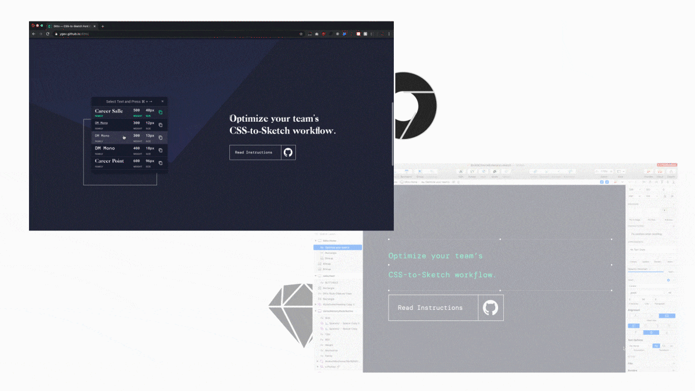

<h1 align="center">
  
 
  <h1 align="center">Sketch Ditto</h1>
 

  

  

    
    

    
  

</h1>

Ditto is a Chrome extension with a companion Sketch plugin that allows designers to copy CSS font styles from live websites and paste them directly into Sketch as Sketch styles. 

## Installation
### Installing the Chrome Extension
Ditto and its updates are currently being processed by the Chrome Store, and until they are published, you will have to install it manually. To begin, download this repository.
1. Open __Chrome__.
2. Go to *__chrome://extensions__* 
3. Toggle “__Developer Mode__” in the upper-right 
4. Click “__Load Unpacked__”
5. Navigate to *__Downloads/ditto-master/chrome/assets__*
6. Click __Open__.

Voila, Ditto should be installed in Chrome. You should see a double-t icon in the extension menu. 

---

### Installing the Sketch Plugin
This one is pretty straightforward.
1. Go to *__Downloads/ditto-master/sketch/__*
2. Run *ditto.sketchplugin__*

Voila, Ditto should be installed in Sketch. You should see Ditto in the Plugins dropdown menu.

  

## Usage
### Using the Chrome Extension
1. Go to a page that you want to copy styles from.
2. Click the gray raccoon head in the corner to activate the plugin. When activated, the double-t icon should be bright teal and an empty __Clipboard History__ modal should appear with instructions on what to do.
4. Select the text you would like to copy and press your desired shortcut. The default shortcut is __Cmd + Right__. I suggest you remap it to something better.

#### Notes about Chrome Extension Usage
- You can select multiple styles in the page, which will appear in the clipboard history. The pink highlight indicates what is currently copied to the clipboard.
- The Clipboard History exists as a way to put previously copied styles back into the clipboard.
- You can drag the Clipboard History in case it’s covering up some text!
- To copy a previously copied style, simply click on an item in the history that you want to copy. It should now be in your clipboard. 
- The clipboard history is per-domain, which means that rei.com and rei.com/subpage/ will share the same clipboard.

---

### Using the Sketch Plugin
1. While the CSS is copied to your clipboard, go to Sketch.
2. Have a text layer ready with some text that you want to re-style.
3. Select the text-layer.
4. Press __Ctrl+Opt+V__ to style the text-layer with the styles in your clipboard.
Again I suggest you remap this shortcut to something better.

#### Notes about Sketch Plugin Usage
- You may use the __Plugins/Paste CSS Styles__ menu instead of the hotkey.

## Styles Available
Ditto is capable of copying the following styles from CSS into Sketch:
- `font-size`
- `color`
- `line-height`
- `font-weight`
- `text-decoration`
- `font-family`
- `font-style`
- `letter-spacing`
- `text-transform`
- `font-variant`
- `text-shadow`

## Contact
- **Maintainer:** Yana Gevorgyan at ygis@mit.edu
- **Initial Creator:** Blake Quigley at blakedquigley@gmail.com
